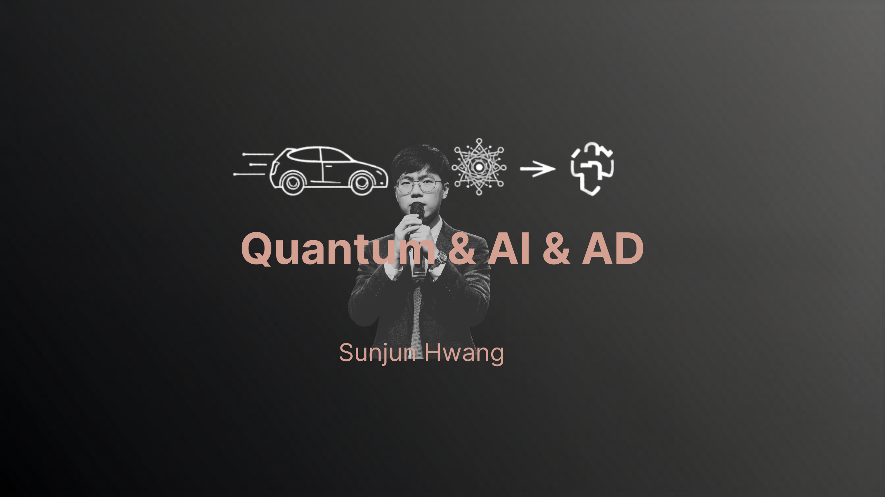
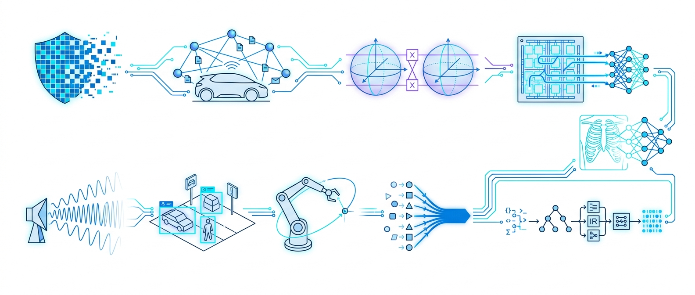

<h1>Sunjun Hwang</h1>

  <b>Researcher</b> &nbsp;&mdash;&nbsp; AI Security · Quantum Computing · Systems &amp; Compilers 
  B.S. in Computer Science &amp; Physics, Yonsei University &nbsp;·&nbsp; currently at ILSC Vancouver Campus, Canada

  I work on making intelligent systems <b>trustworthy, efficient, and deployable</b> &mdash;
  from adversarial robustness and federated learning security, through quantum algorithms
  and NISQ-era circuits, down to the FPGA and compiler layers that actually run them.

  <b>Currently seeking an integrated MS&ndash;PhD position in quantum computing.</b>

  
  
  
  
  
  

  
  <!-- LinkedIn logo is inlined as a data URI: simple-icons dropped the brand, so shields' logo=linkedin renders nothing. -->
  
  
  
  

---

## Research Areas

<table width="100%">
<tr>
<td width="50%" valign="top">

### AI Security

Attack and defense techniques for reliable, safe AI systems &mdash; adversarial
robustness, federated learning security, post-hoc defense, and fault injection.

Adversarial Attack · FL Security · Fault Injection · Trustworthy AI

</td>
<td width="50%" valign="top">

### Autonomous Driving

Autonomous driving systems built on Federated Learning and Large Language Models.
Optimizing FL across heterogeneous and homogeneous models in diverse driving environments.

Federated Learning · LLM · Autonomous Driving · Simulation

</td>
</tr>
<tr>
<td width="50%" valign="top">

### Quantum Computing &amp; Communication

Quantum algorithms, NISQ-era circuits, and variational quantum classifiers.
Quantum key distribution via the BB84 protocol and quantum-secured hybrid communication systems.

Quantum ML · VQC · BB84 · PennyLane · Qiskit

</td>
<td width="50%" valign="top">

### AI Semiconductors

Design and implementation of real-time AI systems on FPGA, AI accelerators, and
neuromorphic computing architectures. Hardware-optimized voice risk detection systems.

FPGA · AI Accelerator · Neuromorphic · CUDA

</td>
</tr>
<tr>
<td width="50%" valign="top">

### Medical AI

AI in healthcare &mdash; pneumonia classification from chest X-rays, federated learning
for medical imaging, and hybrid quantum-classical classification with privacy preservation.

Medical Imaging · Chest X-ray · Federated Learning · Privacy

</td>
<td width="50%" valign="top">

### Network &amp; Communication Security

Adversarial robustness analysis of Automatic Modulation Classification in wireless
communication. Quantum-secured communication systems for tactical military networks.

AMC · Wireless Security · Tactical Network · Quantum Security

</td>
</tr>
<tr>
<td width="50%" valign="top">

### Computer Vision

Visual understanding &mdash; object detection, semantic and instance segmentation,
3D reconstruction, and generative models for image synthesis and style transfer.

Object Detection · Segmentation · 3D Vision · Image Generation

</td>
<td width="50%" valign="top">

### Robotics

Intelligent robotic systems &mdash; motion planning, dexterous manipulation,
sim-to-real transfer learning, and multi-agent coordination for collaborative tasks.

Motion Planning · Manipulation · Sim-to-Real · Multi-Agent

</td>
</tr>
<tr>
<td width="50%" valign="top">

### Large Language Models

LLM capabilities &mdash; prompt engineering, fine-tuning, retrieval-augmented
generation, multi-modal LLMs, and alignment for safe and reliable AI systems.

Prompt Engineering · Fine-tuning · RAG · Multi-modal · Alignment

</td>
<td width="50%" valign="top">

### Compilers

AI/ML compilers (TVM / XLA / MLIR-style graph optimization), hardware-aware compilation
for FPGA, GPU, and NPU backends, quantum circuit compilation for NISQ devices, and
classical compiler and PL theory on LLVM.

AI/ML Compiler · Hardware-aware · Quantum Compiler · LLVM / PL

</td>
</tr>
</table>

---

## Selected Projects

**Quantum Computing &amp; Communication**

| Project | Focus |
| :--- | :--- |
| [SCATTER](https://github.com/justinbrianhwang/SCATTER) | Information-theoretic bounds on telemetry-based intrusion detection in decoy-state BB84 QKD, and the DEGENERACY attack that steals the key while hiding in cheap telemetry. |
| [TRACE](https://github.com/justinbrianhwang/TRACE) | Sequential attribution of eavesdropping versus natural noise in BB84 &mdash; identifiability limits, robust change-point detection, and security-preserving operation. |
| [PHOTON](https://github.com/justinbrianhwang/PHOTON) | Research-grade BB84 QKD simulator with a C++ server, Qt6 dashboard, and Python client SDK. |
| [qfilter](https://github.com/justinbrianhwang/qfilter) | Quantum Filter Zoo &mdash; quanvolution, QPF, and PQC convolution layers for PyTorch, built on PennyLane. |
| [qfz-de](https://github.com/justinbrianhwang/qfz-de) | Dequantization-aware benchmark of fixed quantum filter stems for low-data chest X-ray object detection on RSNA and VinDr-CXR. |

**Autonomous Driving**

| Project | Focus |
| :--- | :--- |
| [MARSHAL](https://github.com/justinbrianhwang/MARSHAL) | Closed-loop CARLA benchmark for authority-aware driving: does the model obey a human traffic director when the directive overrides the traffic rule? |
| [SD2](https://github.com/justinbrianhwang/SD2) | System Deviation Diagnosis &mdash; decomposes the end-to-end driving pipeline and localizes where robustness first collapses under stress. |
| [TORSION](https://github.com/justinbrianhwang/TORSION) | Injects contract-preserving faults as excitation signals to identify which representation boundaries amplify errors into safety failures. |
| [OpenEMMA-UI](https://github.com/justinbrianhwang/OpenEMMA-UI) | Real-time VLM-driven driving UI for CARLA, with Chain-of-Thought reasoning and multi-model vision-language backends. |

**AI Security &amp; Federated Learning**

| Project | Focus |
| :--- | :--- |
| [TopoTrace](https://github.com/justinbrianhwang/TopoTrace) | Oracle-calibrated topological auditing of machine unlearning: does forgotten data leave a persistent-homology trace in the representation space? |
| [FALCON](https://github.com/justinbrianhwang/FALCON) | Failure attribution in federated learning &mdash; localizes which pipeline stage originated a failure via matched record-replay and causal interventions. |
| [UA-D2OFL](https://github.com/justinbrianhwang/UA-D2OFL) | When does reliability-weighted multi-teacher distillation help diffusion-assisted one-shot federated learning? |
| [fl-datafree-backdoor-detection](https://github.com/justinbrianhwang/fl-datafree-backdoor-detection) | Data-free backdoor detection in federated learning via reverse engineering. |

**Medical AI**

| Project | Focus |
| :--- | :--- |
| [CDG-QGAN](https://github.com/justinbrianhwang/CDG-QGAN) | Plants a clinical dependency graph into the entanglement topology of a shallow quantum circuit to generate synthetic MIMIC-IV ICU data. |
| [chestxray-federated-learning](https://github.com/justinbrianhwang/chestxray-federated-learning) | Federated learning experiments on the NIH Chest X-ray14 dataset, with reproducible scripts and a local launcher. |

**Robotics &amp; Systems**

| Project | Focus |
| :--- | :--- |
| [Robot_LLM](https://github.com/justinbrianhwang/Robot_LLM) | Dexterous pick-and-place with a Franka arm and LEAP hand in MuJoCo &mdash; hardcoded control versus a local Qwen2.5-VL policy. |
| [andamento](https://github.com/justinbrianhwang/andamento) | Budgeted autotuning of Pallas TPU kernels: how close to the exhaustive optimum can you get with 20&ndash;100 real measurements? |

---

## Experience &amp; Education

**Research**

| Period | Role |
| :--- | :--- |
| Dec 2024 &ndash; Present | **Undergraduate Researcher**, RAISE Lab &mdash; Reliable AI, System Engineering &amp; Quantum Computing, Yonsei University. Advised by Professor Ko. |

Designing algorithms for AI reliability and interpretability, integrating reliability
frameworks into models to improve robustness and trustworthiness, and working on
interdisciplinary projects that bring quantum mechanics principles into computational
engineering. Findings presented at lab seminars.

**Teaching**

Teaching assistant and tutor, Yonsei University.

| Period | Course |
| :--- | :--- |
| Mar &ndash; Jun 2026 | Artificial Intelligence Mathematics |
| Sep &ndash; Dec 2025 | Artificial Intelligence |
| Mar &ndash; Jun 2025 | Engineering Mathematics (I) |
| Mar &ndash; Jun 2025 | Calculus &amp; Vector Analysis (I) |
| Sep &ndash; Dec 2024 | Java Programming |

**Education**

| Period | Institution |
| :--- | :--- |
| Sep 2026 &ndash; Apr 2027 | **ILSC Language Schools**, Vancouver, Canada |
| Mar 2022 &ndash; Aug 2026 | **B.S., Yonsei University** &mdash; Computer Science (AI) and Physics (Quantum Mechanics) |
| Mar 2018 &ndash; Feb 2021 | Cheongdam High School, Seoul |
| Mar 2015 &ndash; Feb 2018 | Bongeun Middle School, Seoul |
| Mar 2009 &ndash; Feb 2015 | Eonbuk Elementary School, Seoul |

<b>Relevant coursework and school activities</b>

**Yonsei University &mdash; relevant coursework**

| Course | Focus |
| :--- | :--- |
| Artificial Intelligence | Supervised and unsupervised learning, neural networks, and real-world applications. |
| Natural Language Processing | Linguistic structures, sentiment analysis, sequence-to-sequence models, text classification, and machine translation. |
| Quantum Mechanics | Foundations of quantum theory with applications to quantum computing. |
| Computer Architecture | System design, memory management, and processing units. |
| Operating Systems | Process management, memory allocation, and file systems. |
| Data Mining | Techniques for extracting knowledge and patterns from large datasets. |
| Software Engineering | Design patterns, development methodologies, and team-based projects. |
| Mathematics | Advanced concepts essential for computational modeling and algorithm development. |

**ILSC Language Schools** &mdash; Intensive English program covering academic English,
professional communication, and cross-cultural collaboration.

**Cheongdam High School** &mdash; Class President for all three years. Computer club
"Shift" deputy (2018), then president (2019). Science Golden Bell Grand Prize and
Subject Excellence in Integrated Science. Volunteering across multicultural tutoring,
coding education, and community service.

**Bongeun Middle School** &mdash; Robotics, environmental science, and sports clubs,
271 hours in total.

**Eonbuk Elementary School** &mdash; Reading Award for four consecutive years
(grades 1&ndash;4), plus awards in English, research presentation, and family
newspaper contests.

--- | :--- |
| Sep 2026 &ndash; Feb 2027 | ILSC Vancouver Campus, Canada |
| Mar 2022 &ndash; Aug 2026 | **B.S. in Software**, Yonsei University |

---

## Technical Stack

**Languages**

**Machine Learning &amp; Data**

**Quantum**

**Systems &amp; Hardware**

**Simulation &amp; Graphics**

**Web**

---

## Contribution Activity

<picture>
  <source media="(prefers-color-scheme: dark)" srcset="https://raw.githubusercontent.com/justinbrianhwang/justinbrianhwang/output/snake-dark.svg" />
  
</picture>
